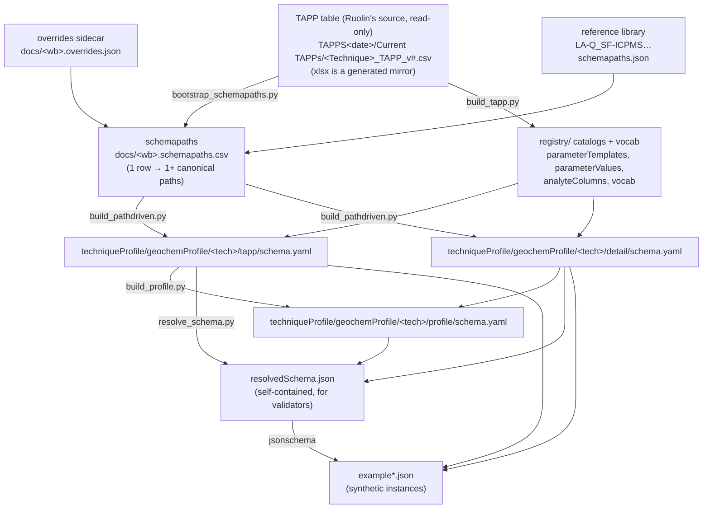

# Generating JSON Schemas from a TAPP Definition Workbook

*How a Technique‑Aligned Protocol Profile (TAPP) spreadsheet becomes a set of validated JSON‑Schema
building blocks.*

This document is written for three audiences. Read the **Big picture** first, then jump to your section:

- **Metadata creator** — you author the Excel workbook. → [§2](#2-metadata-creator-authoring-the-workbook), [§3](#3-shared-concepts-what-the-columns-become)
- **Python developer** — you run/maintain the generator pipeline. → [§4](#4-python-developer-the-pipeline)
- **UI designer** — you build data‑entry forms from the generated schemas. → [§5](#5-ui-designer-building-forms-from-the-schemas)

---

## 1. Big picture

A **TAPP** describes an analytical *protocol* (a `prov:Plan` / lab method) in a technique‑specific way —
e.g. "EPMA/EMPA", "LA‑ICP‑MS geochronology", "Solution Q‑ICP‑MS". A subject‑matter expert captures the
protocol as one row per metadata field in an Excel workbook. The pipeline turns that workbook into three
kinds of JSON‑Schema **building block (BB)**:

| Building block | JSON‑LD root type | What it constrains | Who fills it in |
|---|---|---|---|
| **TAPP definition** (`…/tapp`) | `prov:Plan` / `ada:TAPPDefinition` | The *protocol* — instrument, fixed settings, default parameters | Lab / method author (once per protocol) |
| **Analysis detail** (`…/detail`) | `schema:Dataset` | The *per‑dataset analysis instance* — who/when/what sample, editable parameter values, quality metrics | Analyst / data submitter (once per dataset) |
| **Product profile** (`…/profile`) | `schema:Dataset` + `schema:Product` | The full deliverable = base product profile + the detail + which file `componentType`s are allowed | (validation target for a submitted product) |



The workbook is **hand‑authored**; everything downstream is **generated** and should never be hand‑edited —
fix the workbook (or a tool) and regenerate.

---

## 2. Metadata creator: authoring the workbook

You work in **one worksheet named `TAPP`**, one metadata field per row. The generator reads a fixed set of
columns (extra columns like publication examples are ignored).

### 2.1 The columns that matter

| Column | Purpose |
|---|---|
| **Metadata Item** | The human name of the field (e.g. `Accelerating Voltage`, `Halogen Correction on Oxygen`). Becomes the property/parameter label. |
| **Description / Purpose** | Free text → the schema `description` for that field. |
| **Protocol‑Level Tier** | `Basic` or `Advanced` — where the field lives in the **TAPP definition**. Blank/`N/A` = not a protocol field. |
| **Analysis‑Level Tier** | `Basic`, `Read‑Only`, `Editable`, or `Advanced` — where the field lives in the **detail**. Blank/`N/A` = not in the detail. |
| **Data Type** | Drives the JSON type and controlled‑vocabulary detection (see §2.3). |
| **Example / Allowed Content** | For a controlled vocabulary, the pipe‑separated list of allowed values becomes an `enum`. |

### 2.2 The tier system — the single most important thing to get right

The two tier columns decide **where** a field appears and **what shape** it takes. This is the routing model:

**Protocol‑Level Tier** (→ the TAPP definition):
- `Basic` → a **required top‑level `ada:` property** on the TAPP (a plain value: the protocol fixes it).
- `Advanced` → a **`schema:additionalProperty` parameter** on the TAPP.

**Analysis‑Level Tier** (→ the detail):
- `Basic` → a **required top‑level `ada:` property** in the detail.
- `Editable` / `Advanced` → an **optional `schema:additionalProperty`** entry in the detail.
- `Read‑Only` / blank → **absent** from the detail.

**Dual‑home (the key case).** A field that is **Protocol `Advanced` *and* Analysis `Editable`** is a *default
that can be overridden per dataset*. It appears in **both** places:
- TAPP: a `schema:PropertyValueSpecification` carrying `schema:defaultValue` — the protocol default.
- detail: a `schema:PropertyValue` carrying `schema:value` — the value actually used for that dataset.

> **Worked example — `Halogen Correction on Oxygen`** (Protocol=`Advanced`, Analysis=`Editable`):
> the TAPP gets a `PropertyValueSpecification` (the lab's default correction), and the detail gets a
> `PropertyValue` (what a given analyst actually used). This is how "editable" is expressed: the form shows
> the default from the protocol and lets the analyst change it on the dataset.

**Not every dual‑homed field is a parameter.** The pairing above assumes the field becomes a
`schema:additionalProperty`, so the two halves differ by their tail (`schema:defaultValue` vs
`schema:value`). When an `Advanced`/`Editable` field instead maps to a **first‑class property that
already exists under both roots**, the pair is the *same path shape* under `$MethodDefinition` and
`$Dataset` — no `Default` suffix, no `additionalProperty` synthesis.

> **Worked example — `Coupled Technique(s)`** (Protocol=`Advanced`, Analysis=`Editable`). Both halves
> use the `related link target` family from the grammar:
> - `$MethodDefinition.schema:relatedLink[schema:linkRelationship='coupledTechnique'].schema:target.schema:name`
>   — the coupling the protocol specifies
> - `$Dataset.schema:relatedLink[schema:linkRelationship='coupledTechnique'].schema:target.schema:name`
>   — the coupling actually used for this dataset
>
> All the sidecars of the day carried this item and every one is marked `divergent`, because two picked the
> `$MethodDefinition` root and seven picked `$Dataset`. The resolution is **both rows, not one**.

This is why `tools/add_dual_home_rows.py` **reports** such items rather than generating them: it
recognises a counterpart only from a `…Default` / `…defaultValue` tail, so a first‑class‑property pair
comes out as `TAPP path is not a default`. Those lines are a worklist, not errors.

### 2.3 Data Type → JSON type and controlled vocabularies

- Text like `numeric`/`number` → JSON `number`; `integer` → `integer`; `boolean` → `boolean`; a date → `string`
  (date); otherwise → `string`.
- A Data Type containing **"controlled"** turns the **Example/Allowed Content** cell into an `enum`. Write the
  allowed values pipe‑separated: `Yes | No | Not applicable`. Values starting with `e.g.` or containing
  `specify` are treated as hints, not enum members.

### 2.4 The mapping lives in a sidecar CSV — this is where you edit paths

You **do not** annotate Ruolin's workbook (no inserted columns, no extra tab — a workbook regen would wipe them).
The mapping lives in a separate, per‑workbook **CSV keyed by Metadata Item**: `docs/<workbook>.schemapaths.csv`.
It is the hand‑editable **source of truth**; open it in Excel or any text editor.

| Metadata Item | Protocol Tier | Analysis Tier | Data Type | Schema Path | Source | Notes |
|---|---|---|---|---|---|---|
| Accelerating Voltage | Basic | Read-Only | numeric | `$MethodDefinition.ada:acceleratingVoltage` | inferred | |
| Halogen Correction on Oxygen | Advanced | Editable | Boolean | `$MethodDefinition.schema:additionalProperty[schema:name='…'].schema:defaultValue` | inferred | |
| Halogen Correction on Oxygen | Advanced | Editable | Boolean | `$Dataset.schema:additionalProperty[schema:name='…'].schema:value` | inferred | |
| Some Instrument Field | Advanced | Read-Only | | *(blank)* | **flagged** | needs a path |

- **`Source`** is provenance: `inferred` (bootstrap's guess), `flagged` (couldn't place — fill in the path),
  `authored` (you set it — **preserved verbatim** when the workbook is re‑seeded).
- To fix or add a path: edit the **Schema Path** cell and set **Source** to `authored`. A **dual‑homed
  editable** field is two rows (its TAPP `…defaultValue` + its detail `…value`); a **flagged** row has a blank path.
- The tier / Data Type columns are copied from the workbook for context (refreshed on re‑seed); the
  authoritative content is *(Metadata Item, Schema Path)*.

**Seeding / re‑seeding** (safe to re‑run when Ruolin ships a new workbook — it reconciles by Metadata Item,
preserves your `authored` rows, adds new rows, and flags removed ones):

```bash
python tools/bootstrap_schemapaths.py docs/<workbook>.xlsx
```

The old per‑item name/path override forms are simply CSV edits now: a dataset‑level property is
`$Dataset.ada:<camelName>`; naming fixes (e.g. `3D …` → the illegal `3d…`) are done by writing the intended path.

### 2.5 Reviewing the mapping in Excel

The CSV opens directly in Excel. For a formatted view (flagged rows highlighted, header frozen) run:

```bash
python tools/write_schemapath_sheet.py docs/<workbook>.xlsx   # -> docs/<workbook>.schemapaths.xlsx
```

This renders the **CSV** (never Ruolin's source workbook) as a styled `.xlsx`. Edit the CSV, not the xlsx.

---

## 3. Shared concepts: what the columns become

### 3.1 Schema‑path grammar (the intermediate language)

Each workbook row is compiled to one or more **canonical schema paths** (stored in the sidecar
`docs/<wb>.schemapaths.csv`). Two roots anchor every path:

- **`$MethodDefinition`** — the TAPP definition (the protocol/plan).
- **`$Dataset`** — the product/detail (the analysis instance).

Examples:

| Row | Canonical path(s) |
|---|---|
| `Accelerating Voltage` (Basic protocol) | `$MethodDefinition.ada:acceleratingVoltage` |
| `Laboratory` (identity) | `$MethodDefinition.schema:location.schema:Place.schema:name` |
| `Halogen Correction on Oxygen` (Advanced+Editable) | `$MethodDefinition.schema:additionalProperty[schema:name='Halogen Correction on Oxygen'].schema:defaultValue` **and** `$Dataset.schema:additionalProperty[schema:name='Halogen Correction on Oxygen'].schema:value` |
| `Analyst` (analysis identity) | `$Dataset.schema:contributor[schema:roleName='analyst'].schema:name` |

`[key='value']` is a **selector** — it says "the array item whose `key` equals `value`". `[@type='…']` selects
by JSON‑LD type.

### 3.2 Parameters: `PropertyValueSpecification` vs `PropertyValue`

Advanced/editable fields are modeled as schema.org parameter objects, catalogued once in the shared registry
and referenced by every technique:

- **`schema:PropertyValueSpecification`** — a *specification with a default*. Has `schema:defaultValue`. Used in
  the **TAPP** (the protocol default).
- **`schema:PropertyValue`** — an *actual value*. Has `schema:value`. Used in the **detail** (per dataset).

Both carry a resolvable `schema:propertyID` `@id` (`ada:parameter/<tapp>/<name>`) so an instance value can be
dereferenced to its definition. All parameter `@id`s across all TAPPs are aggregated into a master SKOS code
list (`registry/vocab/adaAnalyticalParameters.json`).

### 3.3 Analyte columns and controlled vocabularies

- **Analyte columns** (`ada:analyteTemplate.ada:analyteColumns`) describe per‑element table columns for
  techniques with a per‑analyte axis (LA‑ICP‑MS, EMPA). Techniques without one (XCT, imaging) omit them.
- **Controlled vocabularies** become both an inline `enum` on the field **and** a standalone SKOS
  `ConceptScheme` file under `registry/vocab/` for reuse.

---

## 4. Python developer: the pipeline

### 4.1 Repository layout (`_sources/`, group‑by‑technique)

```
_sources/
  registry/                         # cross-technique catalogs, referenced by $ref
    analyteColumns/  parameterTemplates/  parameterValues/  vocab/
  BaseSchema/                        # foundation BBs
    tappDefinition/  adaProduct/  instrument/ laboratory/ image/ tabularData/ …
  techniqueProfile/geochemProfile/<Tech>/           # one folder per technique, e.g. EMPA, LA-ICPMS, XCT
    tapp/          # the TAPP definition BB
    detail/        # the analysis-instance detail BB
    profile/       # the path-driven product profile
    profile-ada/   # the generic ADA product profile (where present)
```

Each BB folder is: `schema.yaml` (source) + `resolvedSchema.json` (compiled, self‑contained) +
`bblock.json` (register metadata) + `example*.json`. The BB's identifier is derived from its path
(`ogch.techniqueProfile.EMPA.tapp`).

### 4.2 The tools (in run order)

| Step | Tool | In → Out |
|---|---|---|
| 1 | `bootstrap_schemapaths.py <wb.xlsx>` | workbook (+ LA‑Q reference library) → **seeds/re‑seeds** `docs/<wb>.schemapaths.csv` (preserving `authored` rows) |
| — | *(review/edit the CSV — §2.4)* | the CSV is the hand‑authored source of truth |
| 2 | `build_tapp.py <tappName>` | workbook → registry catalogs + `vocab/` + `bblock.json` (also writes a transient matrix schema that step 3 overwrites) |
| 3 | `build_pathdriven.py <tappName>` | reads `schemapaths.csv` → `tapp/schema.yaml` + `detail/schema.yaml` + `-P0` example instances |
| 4 | `build_profile.py <tappName>` | → `profile/schema.yaml` + example (adaProduct + detail + componentType constraints) |
| 5 | `resolve_schema.py --file <schema.yaml> -o <resolvedSchema.json>` | inlines all `$ref`s (local + remote CDIF) into a self‑contained schema |
| 6 | validate | `jsonschema` each `example*.json` against its `resolvedSchema.json` |

The mapping is read via `schemapath_io.py` (`load_spec` collapses the CSV to `{item: path(s)}`), and
tables via `tapp_source.py`, which takes `.csv` or `.xlsx` — the library moved to CSV with the
2026-08 delivery. `tapp_source` also answers which delivery is current, where its modules are, and
where the newest `composed_tapps.json` is, so no tool hard-codes a delivery.

### 4.2a Taking in a new delivery

The tables are Ruolin's and arrive as a dated folder. We never edit them, so the risk is not merge
conflicts but **drift** — a rename upstream invalidates sidecar rows keyed on Metadata Item, and it
fails quietly.

| Tool | What it answers |
|---|---|
| `intake_delivery.py TAPPS<date>` | **Run first.** Read-only: what would carry, rename, be **dropped** or arrive flagged; what composing a module would change; which paths no longer resolve |
| `migrate_sidecar.py <tapp> --source <table> [--seed <tapp>] --write` | carries a sidecar onto a new revision, rewriting the selector literals that quote item names |
| `seed_module_sidecars.py [--modules-dir D] --write` | fills module sidecars from the technique consensus; never replaces an existing path with a flag |
| `module_conflict_check.py` | what composing a module would do to consumers — TIGHTENS / LOOSENS / ABSENT / ADDS |
| `build_module_bb.py --write` | generates a module building block from its CSV + sidecar |
| `draft_module.py --measure` | drafts candidate modules and measures what they would save |
| `fill_flagged.py --write` | places flagged rows from sidecars that already solved them |
| `gen_grammar_doc.py --write` | regenerates the family table in `SCHEMA_PATH_GRAMMAR.md` |

**Read `DROPPED` closely.** An item that looks deleted is usually renamed beyond the mechanical
rules, and its authored paths go with it. Confirm against the new table's own Description, then
record it in `migrate_sidecar.ALIASES` rather than letting the paths be discarded.

Other utilities: `write_schemapath_sheet.py <table>` (render a sidecar as a styled `.xlsx`);
`build_parameter_codelist.py` (master parameter SKOS scheme); `bb_locate.py` (resolve a BB by its
pre‑reorg identity name); `audit_building_blocks.py --filter <bb>` (building-block completeness).

### 4.3 Adding a new technique

1. The source table is already in the delivery — it is Ruolin's, and we never copy or edit it.
   Add a `TAPP_CONFIGS[<tappName>]` entry in `build_tapp.py` pointing `xlsx` at it (the key is
   historical; it takes a `.csv` too), plus `prefix`, `component_types`, titles, and the
   technique‑dir in `TECH_DIR`. **Two strings name the source** — the `xlsx` key and the path quoted
   in `description` — and missing the second leaves the schema citing a stale table.
2. Seed the sidecar. If a curated neighbour exists, prefer it:
   `migrate_sidecar.py <tapp> --source <table> --seed <nearest tapp> --write` — SEM v17 shares 70%
   of its fields with EPMA, Solution MC 76% with Solution Q. Otherwise
   `bootstrap_schemapaths.py <table>`, then inspect the coverage report and resolve flagged rows.
3. `build_tapp.py` → `build_pathdriven.py` → `resolve_schema.py` (tapp + detail) → validate.
4. For a product profile, add an entry to `build_profile.py:PROFILES` and run it (+ resolve + validate).

### 4.4 Gotchas

- **schema paths are logical, not filesystem paths** — moving BB folders never affects `schemapaths.json`.
- **resolved schemas are self‑contained** (no relative `$ref`s), so they're portable and are the validation
  source of truth.
- **Shared registries reformat on regen** — `git checkout` the two catalog `schema.yaml` files after a spot
  regeneration if you only meant to touch one technique.
- **Never hand‑edit generated artifacts** — trace to the workbook/tool and regenerate.

---

## 5. UI designer: building forms from the schemas

You build **two forms** from two schemas, matching the two authoring moments:

1. **Protocol form** ← the **TAPP definition** schema (`techniqueProfile/geochemProfile/<tech>/tapp/resolvedSchema.json`).
   Filled once when a lab registers a protocol.
2. **Dataset form** ← the **analysis detail** schema (`…/detail/resolvedSchema.json`). Filled per submitted
   dataset. It links back to a chosen TAPP by `@id`.

Use the **`resolvedSchema.json`** (self‑contained) to drive the form, and the **`example*.json`** as a
ready‑made "filled form" reference.

### 5.1 Reading the schema into widgets

| In the schema | Form widget |
|---|---|
| `required: [...]` (top of an object) | mark those fields mandatory |
| a property with `type: string` | text input |
| `type: number` / `integer` / `boolean` | number field / checkbox |
| a property with an `enum` | **dropdown / radio** (values are the allowed vocabulary) |
| `description` | field help text / tooltip |
| `ada:componentType` with an `enum` of `ada:…` values | file‑type selector for each archived file |

### 5.2 Parameters: defaults and editability

Fields under **`schema:additionalProperty`** are parameter objects, and their JSON‑LD `@type` tells you how to
render them:

- **`schema:PropertyValueSpecification`** (in the protocol form): show `schema:name`, capture
  `schema:defaultValue`. This is the lab's default.
- **`schema:PropertyValue`** (in the dataset form): capture `schema:value` (+ `schema:unitText` if present).

**Editable parameters are the dual‑home pair.** The same field appears in both schemas. Best UX: in the dataset
form, **pre‑fill the value from the protocol's `defaultValue`** (look it up via the parameter's
`schema:propertyID` `@id`, which is identical in both), and let the analyst override it. Read‑only protocol
parameters appear only in the protocol form.

### 5.3 The fixed CDIF/provenance shell (dataset form)

The detail sits on a `schema:Dataset` and reuses standard slots, so parts of the dataset form are the same for
every technique:

- `schema:contributor` with `schema:roleName: "analyst"` → **Analyst** field.
- `prov:wasGeneratedBy` → **session dates**, **sample** (`schema:object`), per‑analysis parameters.
- `schema:funding` → **funding source**; `dqv:hasQualityMeasurement` → **quality metrics**;
  `schema:measurementTechnique` (an **array**) → link to the TAPP by `@id`.

Everything technique‑specific is the top‑level `ada:` properties (required analysis fields) plus the
`schema:additionalProperty` parameters described above.

### 5.4 Practical tips

- Drive labels from `schema:name` / the property key; drive help from `description`.
- Treat any property whose value schema is `{enum: [...]}` as a closed pick‑list.
- `schema:measurementTechnique`, `schema:funding`, `prov:wasGeneratedBy`, and componentType `hasPart` are
  **arrays** — render as repeatable groups.
- Validate the assembled instance against `resolvedSchema.json` client‑side before submit; the shipped
  `example*.json` is a known‑good payload for tests and placeholders.

---

## 6. Quick reference

**Regenerate one technique end‑to‑end** (replace `<tapp>` / `<Tech>`):

```bash
python tools/bootstrap_schemapaths.py docs/<Workbook>.xlsx
python tools/build_tapp.py <tapp>
python tools/build_pathdriven.py <tapp>
python tools/resolve_schema.py --file _sources/techniqueProfile/geochemProfile/<Tech>/tapp/schema.yaml   -o _sources/techniqueProfile/geochemProfile/<Tech>/tapp/resolvedSchema.json
python tools/resolve_schema.py --file _sources/techniqueProfile/geochemProfile/<Tech>/detail/schema.yaml -o _sources/techniqueProfile/geochemProfile/<Tech>/detail/resolvedSchema.json
python tools/build_pathdriven.py <tapp> --validate
python tools/build_profile.py <tapp>          # optional: product profile
```

**Key files**

- Source table: `TAPPS<date>/Current TAPPs/<Technique>_TAPP_v#.csv` — Ruolin's read-only source (newest `TAPPS<date>/` delivery, resolved by `tapp_source.current_delivery()`); the xlsx is a generated mirror, never annotated
- Path mapping (source of truth): `docs/<wb>.schemapaths.csv` — hand‑authored, keyed by Metadata Item
- Generated BBs: `_sources/techniqueProfile/geochemProfile/<Tech>/{tapp,detail,profile}/`
- Shared catalogs: `_sources/registry/{parameterTemplates,parameterValues,analyteColumns,vocab}/`
- Foundation: `_sources/BaseSchema/{tappDefinition,adaProduct,…}/`
